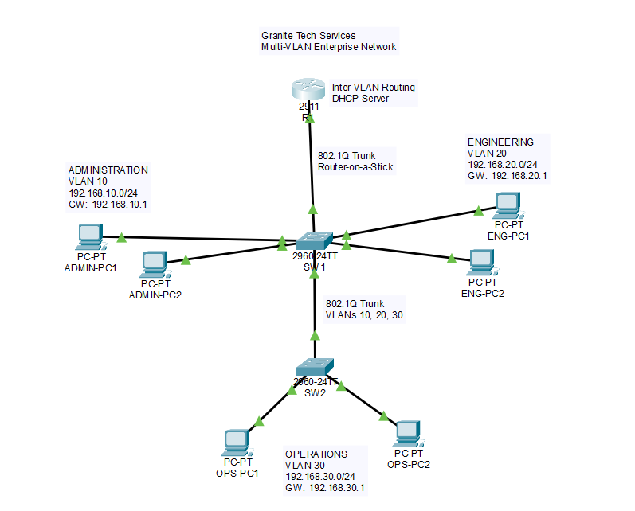
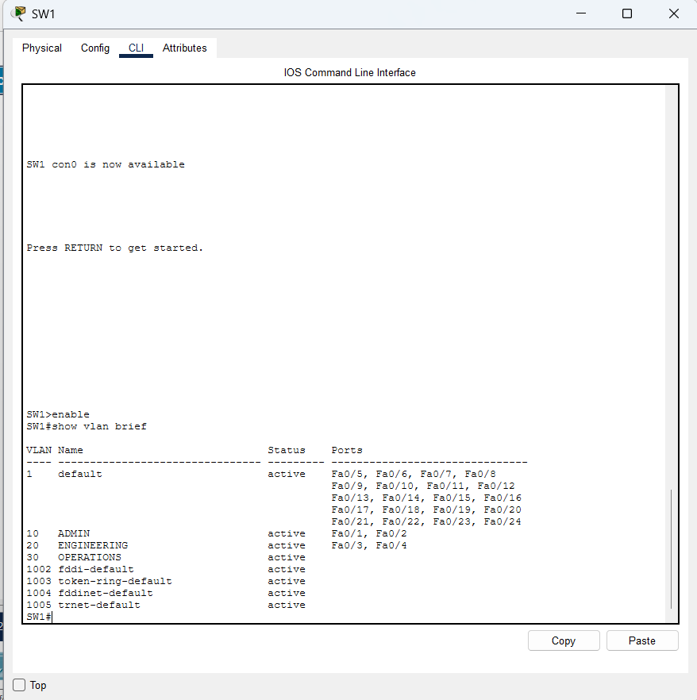
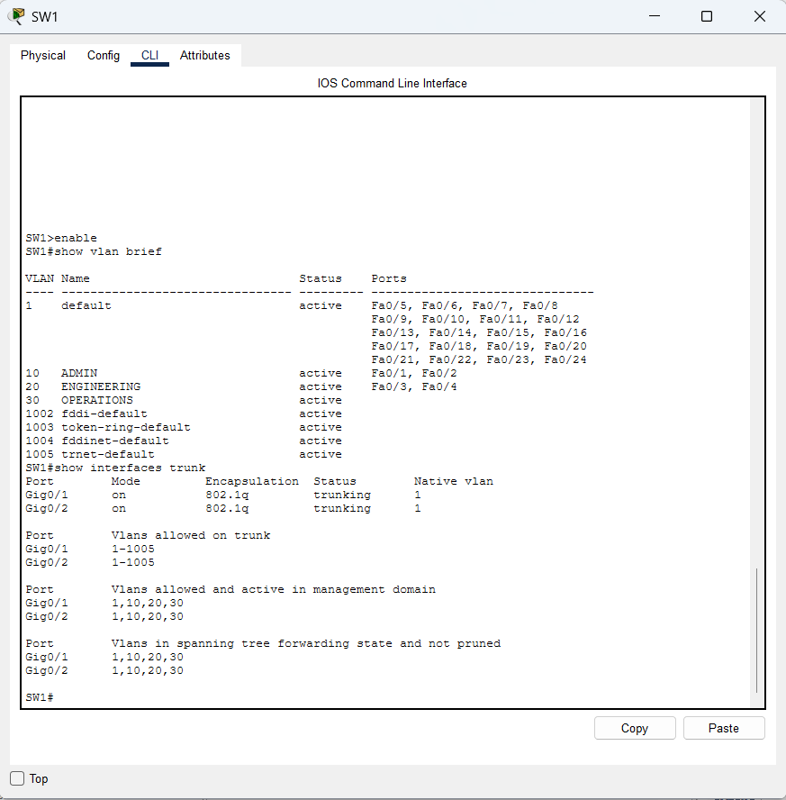
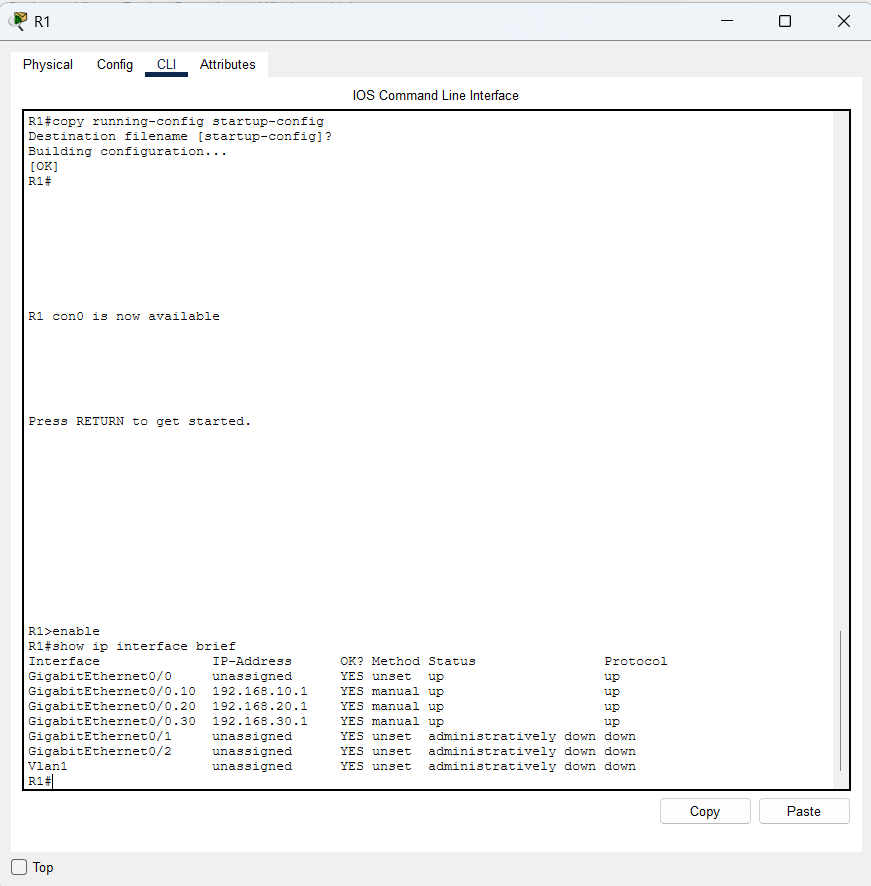
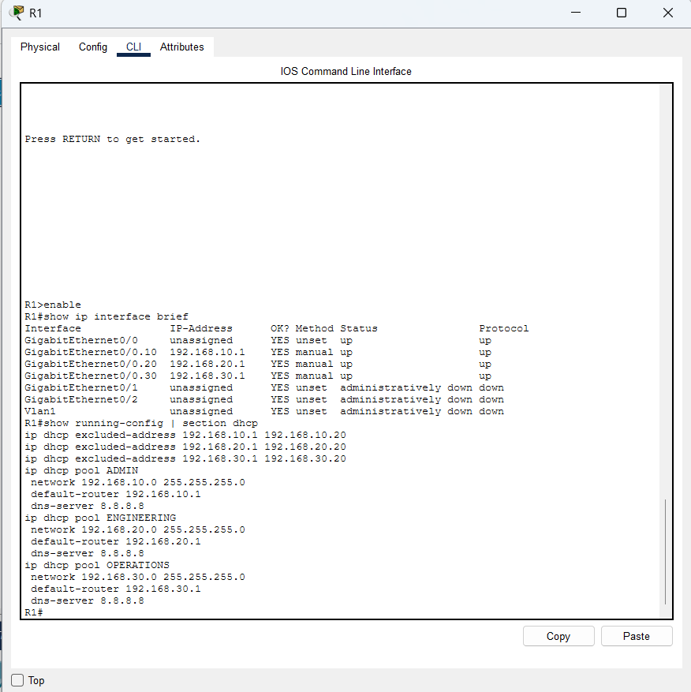
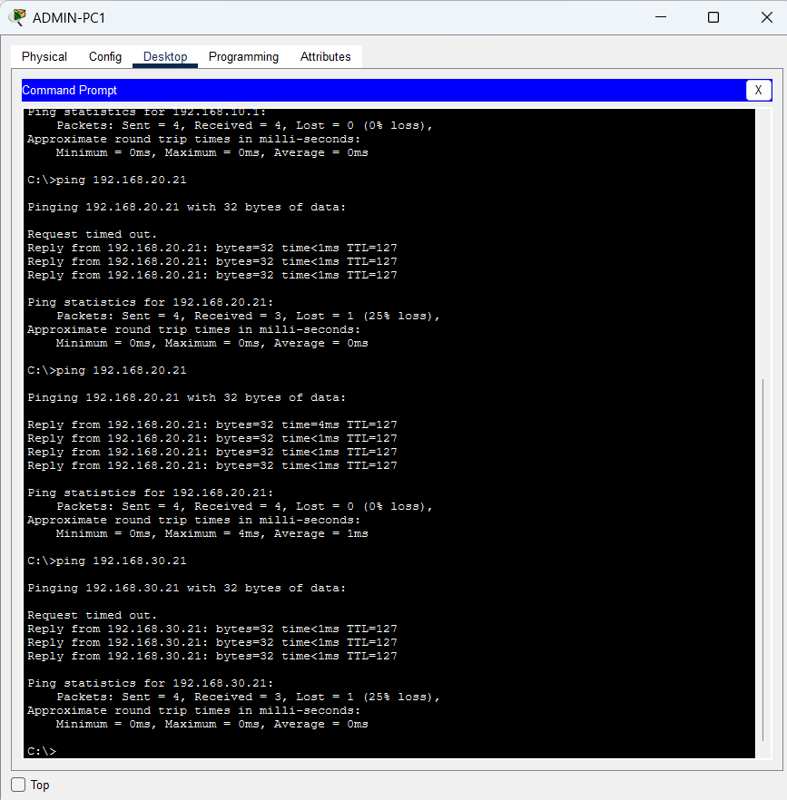

# Granite Tech Services – Multi-VLAN Enterprise Network

A Cisco Packet Tracer project simulating a small business network divided into Administration, Engineering, and Operations departments.

The network uses VLAN segmentation, 802.1Q trunking, router-on-a-stick inter-VLAN routing, and DHCP to provide organized and reliable connectivity across multiple departments.

## Network Topology

The topology separates Administration, Engineering, and Operations into individual VLANs while using 802.1Q trunks and router-on-a-stick to provide connectivity between departments.

## Network Design

| Department | VLAN | Network | Default Gateway |
|---|---:|---|---|
| Administration | 10 | 192.168.10.0/24 | 192.168.10.1 |
| Engineering | 20 | 192.168.20.0/24 | 192.168.20.1 |
| Operations | 30 | 192.168.30.0/24 | 192.168.30.1 |

## Technologies & Skills Demonstrated

- Cisco IOS configuration
- VLAN creation and access-port assignment
- IEEE 802.1Q trunking
- Router-on-a-stick
- Inter-VLAN routing
- DHCP configuration
- IPv4 addressing and subnetting
- Network connectivity testing
- Troubleshooting and configuration verification
- Network documentation

## Infrastructure

The simulated environment consists of:

- 1 Cisco 2911 router
- 2 Cisco 2960 switches
- 6 client PCs
- 3 departmental VLANs

SW1 connects Administration and Engineering devices, while SW2 connects Operations devices. An 802.1Q trunk between the switches carries VLAN traffic across the network.

R1 uses subinterfaces for VLANs 10, 20, and 30 to provide inter-VLAN routing and serves as the DHCP server for all three networks.

## DHCP

Separate DHCP pools automatically provide addressing information to each department.

Addresses 192.168.X.1 through 192.168.X.20 are excluded from each pool to reserve space for gateways and other infrastructure devices.

## Testing & Verification

The network was verified using Cisco IOS commands including:

- `show vlan brief`
- `show interfaces trunk`
- `show ip interface brief`
- `show running-config | section dhcp`

End-to-end ICMP testing confirmed successful communication between devices in different VLANs, including Administration-to-Engineering and Administration-to-Operations traffic.

## Configuration Verification

### VLAN Configuration

VLANs 10, 20, and 30 were configured for Administration, Engineering, and Operations, with switch access ports assigned to the appropriate departments.

### 802.1Q Trunk Verification

Trunk links carry VLANs 10, 20, and 30 between network infrastructure devices.

### Router-on-a-Stick Configuration

Router subinterfaces provide a Layer 3 default gateway for each VLAN.

### DHCP Configuration

R1 provides separate DHCP pools for each department while reserving the first 20 addresses of each subnet for infrastructure and static assignments.

### Inter-VLAN Connectivity Test

Successful ICMP tests from the Administration VLAN to Engineering and Operations verify end-to-end inter-VLAN connectivity.

## Troubleshooting

During testing, an Administration client successfully received a DHCP address but was assigned an incorrect default gateway.

The DHCP configuration was inspected, the incorrect gateway was identified in the ADMIN pool, and the configuration was corrected. After renewing the DHCP lease, the client received the proper `192.168.10.1` gateway and inter-VLAN connectivity was successfully verified.

## Project File

`GraniteTech_Enterprise_Network.pkt` contains the complete Cisco Packet Tracer topology and device configurations.
